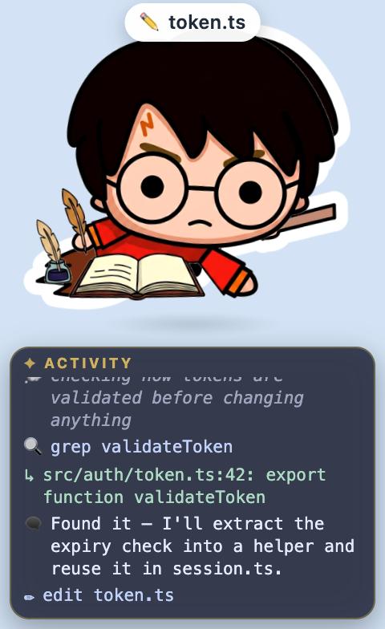
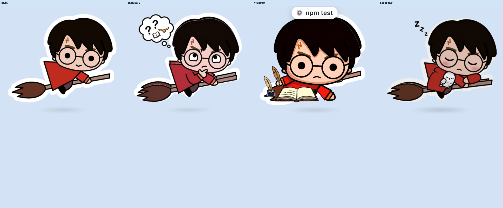

# Scrybe Pet

A desktop pet for [opencode](https://opencode.ai) that **scries** your session
and **scribes** it live. A little wizard on a broom sits on top of your screen
and relays what your agent is doing: the model's streaming reasoning and
replies, every tool call and its output, plans, permissions, and the final
result. He reacts as work happens (casting while editing, zooming while running
commands, celebrating on success, tumbling on errors) and dozes off when
opencode isn't running.

Think of it as a tiny, glanceable "what is my agent doing right now?" companion.



## Features

- **Live relay.** A transcript panel streams the session as it happens — your
  prompt, the model's **reasoning** and **response text** (streaming, updating
  in place), each tool call with its target, and the tool **output**.
- **Live status bubble.** The current action + target at a glance:
  `✏️ main.js`, `⚙️ npm test`, `🔍 TODO`, `📝 3/5 done`, `❓ allow bash?`.
- **Per-mood faces.** The pet's face changes with the work — eyes glance **up**
  while thinking, **narrow** with focus while working, and **close** while
  asleep — on top of a mood colour-grade and distinct flight motion.
- **Per-tool spellwork.** The wand/broom glow colour and a floating prop change
  per tool (edit ✍️ · read 📖 · bash 🧪 · grep 🔍 · fetch 🦉 · task 🪄 · plan 📜).
- **Auto wake / sleep.** Wakes the moment opencode connects (heartbeat), stays
  awake while it runs, naps when it disconnects.
- **Stays put & draggable.** Sits where you leave him; drag to reposition
  (remembered across restarts).
- **Sound, sizing, and a right-click menu.** Completion chime (mutable), four
  sizes, toggle the log, reset position, quit.



## How it works

```
opencode ──(plugin)──► ~/.cache/opencode-pet/state.json ──(watch)──► Electron overlay
```

- **`plugin/pet.ts`** — an opencode plugin (Node built-ins only). It hooks into
  session/tool/message events, keeps a rolling relay of the last steps + the
  streaming reasoning/response, and writes it (throttled) to a small state file.
  It also pulses a heartbeat and launches the overlay.
- **`app/`** — a transparent, always-on-top Electron window. The character is a
  raster sprite (`app/renderer/sprite.png`, plus `sprite-thinking.png`,
  `sprite-working.png`, and `sprite-sleeping.png` for the per-mood faces)
  animated with CSS; moods are carried by flight motion, colour-grade, and
  overlays. Click-through everywhere except the character itself.

The overlay and plugin talk only through files in `~/.cache/opencode-pet/`, so
there are no ports and nothing to configure.

> **Swapping the art.** The character lives in `app/renderer/` as `sprite.png`
> plus `sprite-thinking.png`, `sprite-working.png`, and `sprite-sleeping.png`
> (each used for that state, falling back to `sprite.png` when absent). Replace
> any of them with your own square, transparent-background PNG and restart the
> overlay.

## Install

Requires [Node.js](https://nodejs.org) and [opencode](https://opencode.ai).

```sh
git clone https://github.com/g3saranath/opencode-pet.git ~/opencode-pet
cd ~/opencode-pet
npm install                                     # downloads Electron

# register the plugin with opencode (global)
mkdir -p ~/.config/opencode/plugin
ln -sf ~/opencode-pet/plugin/pet.ts ~/.config/opencode/plugin/pet.ts
```

Then **restart opencode**. Scrybe appears automatically and starts relaying the
session. (Plugins load only at startup, so restart after any change.)

> Prefer not to auto-launch on session start? Set `OPENCODE_PET_NO_LAUNCH=1` and
> run the overlay yourself with `npm start`.

## Controls

| Action        | How                                                    |
| ------------- | ------------------------------------------------------ |
| Move          | Left-click and drag                                    |
| Menu          | **Right-click** — Size, Mute, Activity log, Reset, Quit |
| Resize        | Right-click ▸ Size ▸ Small / Medium / Large / Huge     |
| Mute sounds   | Right-click ▸ Mute sounds                              |
| Show/hide log | Right-click ▸ Show activity log                        |
| Quit          | Right-click ▸ Quit, or `Ctrl`+`Alt`+`P`                |
| Run manually  | `npm start`                                            |

## Configuration

| Variable                   | Effect                                                     |
| -------------------------- | ---------------------------------------------------------- |
| `OPENCODE_PET_DIR`         | Path to this checkout (auto-detected if `~/opencode-pet` or `~/opencode-scrybe`) |
| `OPENCODE_PET_NO_LAUNCH=1` | Don't auto-launch the overlay from the plugin              |

Runtime files (in `~/.cache/opencode-pet/`): `state.json` (current relay),
`heartbeat` (connection pulse), `pet.pid` (overlay pid), `pos.json` (position),
`config.json` (size / mute / log preferences).

## Platform

Built and tested on macOS (Apple Silicon). It uses standard Electron overlay
APIs, so Linux/Windows should work with minor tweaks — PRs welcome.

## Contributing

Issues and PRs are welcome. The code is deliberately small and dependency-light
(one Electron dep for the app; the plugin uses only Node built-ins).

## License

[MIT](LICENSE) © g3saranath

## Notice

The bundled character art is fan art of a well-known wizard-on-a-broom
character. This project is **not affiliated with, endorsed by, or associated
with** Warner Bros., J.K. Rowling, or the Harry Potter franchise, and is shared
for non-commercial, personal use only. All related trademarks and copyrights
belong to their respective owners. Swap in your own artwork (see **Swapping the
art**) if you prefer.
